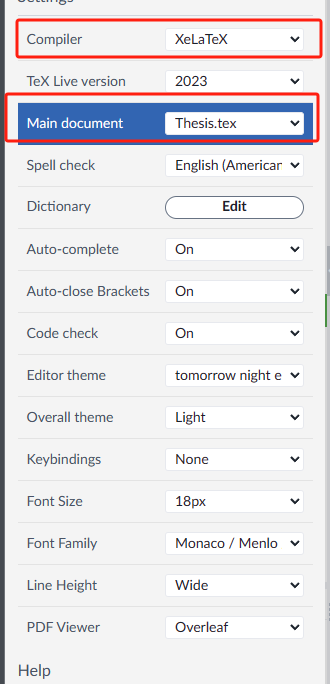

# 中国科学院大学学位论文LaTex模板 2023 版本

## 使用说明

2022年修订的《中国科学院大学研究生学位论文撰写规范和指导意见》（以下简称《指导意见》）从2023年冬季批次开始实施。为方便各位同学使用，特提供此模板。

您在使用此模板进行学位论文撰写时，只需根据《指导意见》在相应章节填写具体内容即可。

### 1. 下载模板

- 每个学院都提供了下载链接，以各个学院的要求为准
- 这个repo会根据反馈实时更新修正问题，可能与学院提供的模板有所不同
- 如遇到问题，请在issue中提出，我们会尽快解决并更新在这个repo中

### 2. 使用模板
支持的系统：Windows, Linux, MacOS，同时支持Overleaf在线编辑器（推荐，无需安装配置环境）

| 系统 | 编译工具 | 推荐编辑器 |
| --- | --- | --- |
| Windows | [TexLive Full](https://www.tug.org/texlive/acquire-netinstall.html) 或 [MiKTex](https://miktex.org/download) | [Texmaker](http://www.xm1math.net/texmaker/) 或 [VSCode](https://code.visualstudio.com/)
| Linux | [TexLive Full](https://www.tug.org/texlive/acquire-netinstall.html) | [Texmaker](http://www.xm1math.net/texmaker/) 或 [VSCode](https://code.visualstudio.com/)
| MacOS | [MacTex Full](https://www.tug.org/mactex/) | [Texmaker](http://www.xm1math.net/texmaker/) 或 [TexShop](http://pages.uoregon.edu/koch/texshop/)
| Overleaf | XeLaTeX+TexLive2021 | [Overleaf](https://www.overleaf.com/)

Overleaf 的配置参考下图，选择 XeLaTeX 编译器，编译器版本选择 TeX Live 2021。

